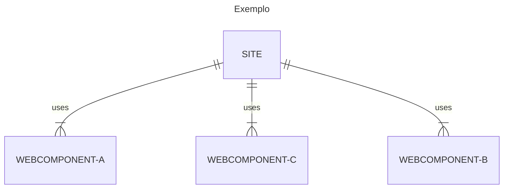

# O que são Webcomponents e como desenvolvê-los

## O que são Webcomponents
Web Components são um conjunto de especificações elaboradas para permitir a criação de elementos web de forma customizada e independente.
Sites construídos com esse conceito tornam-se mais fáceis de manter, isto porque a alteração realizada num elemento será replicada em todo o site, facilitando as alterações e aumentando a produtividade.



## Como desenvolvê-los
Apartir do ES6 é possivel estender classes javascritp para criar elementos customizados (Custom Elements). Neste caso pode-se estender os existentes ou até mesmo criar o seu próprio elemento HTML.

### Como estender uma tag HTML?
```javascript
class MyParagraph extends HTMLParagraphElement {
    constructor(){
        super();
        this.innerText = "My Custom Paragraph"
    }
}
// register tag
customElements.define("my-paragraph", MyParagraph, {extends:"p"})
```

```html
<p is="my-paragraph"></p>
```

<iframe width="100%" height="300" src="https://jsfiddle.net/techmista/d1ne6kby/7/embedded/" frameborder="0"></iframe>
### Exemplos
- Exemplo 1: Estendendo um elemento existente
- Exemplo 2: Criando o seu proprio Elemento HTML
