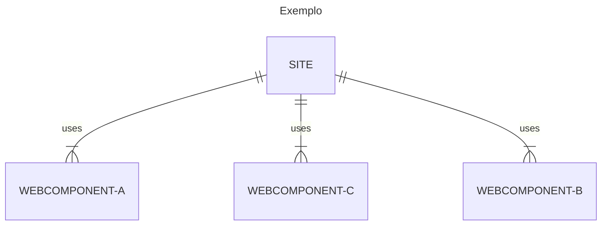

# O que são Webcomponents e como desenvolvê-los

## O que são Webcomponents
Web Components são um conjunto de especificações elaboradas para permitir a criação de elementos web de forma customizada e independente.
Sites construídos com esse conceito tornam-se mais fáceis de manter, isto porque a alteração realizada num elemento será replicada em todo o site, facilitando as alterações e aumentando a produtividade.



## Como desenvolvê-los
Apartir do ES6 é possivel estender classes javascritp para criar elementos customizados (Custom Elements). Neste caso pode-se estender os existentes ou até mesmo criar o seu próprio elemento HTML.

### Como estender uma tag HTML?
```javascript
class MyParagraph extends HTMLParagraphElement {
    constructor(){
        super();
        this.innerText = "My Custom Paragraph"
    }
}
// register tag
customElements.define("my-paragraph", MyParagraph, {extends:"p"})
```

```html
<!-- Tag -->
<p is="my-paragraph"></p>

<!-- Result -->
<p>My Custom Paragraph</p>
```
### Como criar uma tag
```javascript
class HelloWorldParagraph extends HTMLElement {
    constructor(){
        super();
        let name = this.getAttribute("name") ? `${this.getAttribute("name")}` : "";
        this.innerText = `Hello World${name}!`;
    }
}
// register tag
customElements.define("hello-world", HelloWorldParagraph, {extends:"p"})
```

```html
<!-- Tag -->
<hello-world name="Fulano"></hello-world>

<!-- Result -->
<p>Hello World Fulano!</p>
```

### Exemplos
- [Exemplo 1: Estendendo um elemento existente](https://game-of-devs.github.io/how-to-develop-webcomponents/exemplos/load-posts/src/index.html)
- [Exemplo 2: Criando o seu proprio Elemento HTML](https://game-of-devs.github.io/how-to-develop-webcomponents/exemplos/address-autocomplete/src/index.html)
