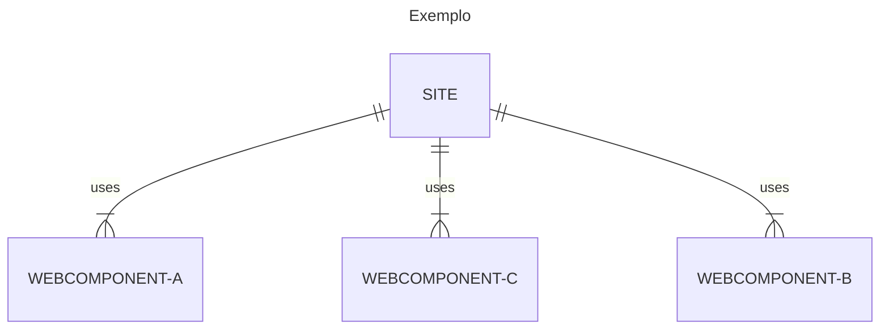

# O que são Webcomponents e como desenvolvê-los

## O que são Webcomponents
Web Components são um conjunto de especificações elaboradas para permitir a criação de elementos web de forma customizada e independente.
Sites construídos com esse conceito tornam-se mais fáceis de manter, isto porque a alteração realizada num elemento será replicada em todo o site, facilitando as alterações e aumentando a produtividade.



## Como desenvolvê-los
Apartir do ES6 é possivel estender classes javascritp para criar elementos customizados (Custom Elements). Neste caso pode-se estender os existentes ou até mesmo criar o seu próprio elemento HTML.

### Exemplo 1: Estendendo um elemento existente
Nesse exemplo, usaremos uma tag table(tabela) para que o elemento realize uma requisição na API publica https://jsonplaceholder.typicode.com/posts para listar o titulo dos posts, colocando o id e o titulo ao lado.


```javascript
// main.js

class MyPostTable extends HTMLTableElement{
    constructor() {
        super();
        this.init();
        this.render();
    }

    init() {
        this.thead = document.createElement('thead');
        this.append(this.thead);

        this.tbody = document.createElement('tbody');
        this.append(this.tbody);
    }

    render(){
        this.thead.innerHTML = `<tr><th>ID</th><th>Title</th></tr>`
        this.request().then(
            (json)=>{
                for (const i in json) {
                    this.tbody.innerHTML +=  `<tr><td>${json[i]["id"]}</td><td>${json[i]["title"]}</td></tr>`
                }

            }
        )
    }
    
    async request(){
        const url = this.getAttribute("data-url");
        let resp = await fetch(url)
        return resp.json();
    }

}

customElements.define('my-post-table', MyPostTable, {extends:'table'})
```

```html
<!-- index.html -->

    <!DOCTYPE html>
<html lang="en">
<head>
    <meta charset="UTF-8">
    <title>Title</title>
</head>
<body>
<style>
    table {
        border: 1px solid #eee;
    }

    table th {
        text-align: center;
    }

    tbody tr:nth-child(odd) {
        background-color: aliceblue;
    }

    tbody td:nth-child(odd) {
        text-align: center;
    }
    tbody td:nth-child(even) {
        text-transform: uppercase;
    }

</style>
<table is="my-post-table" data-url="https://jsonplaceholder.typicode.com/posts"></table>
<script src="main.js" type="module"></script>
</body>
</html>
```
